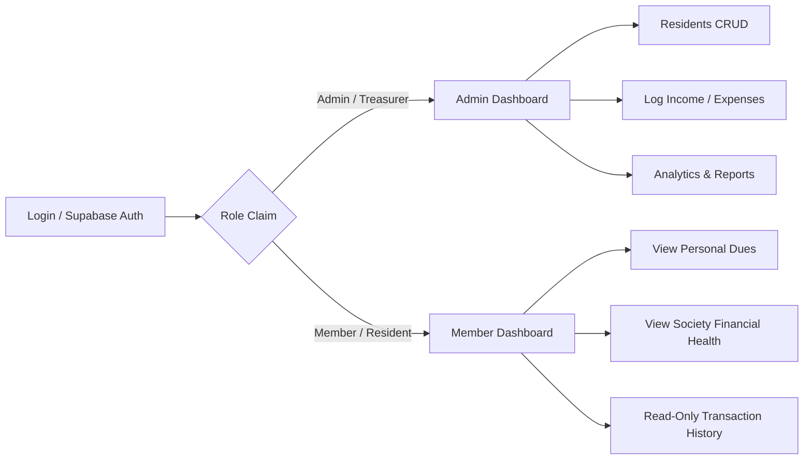
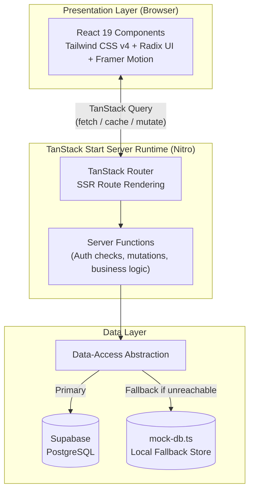
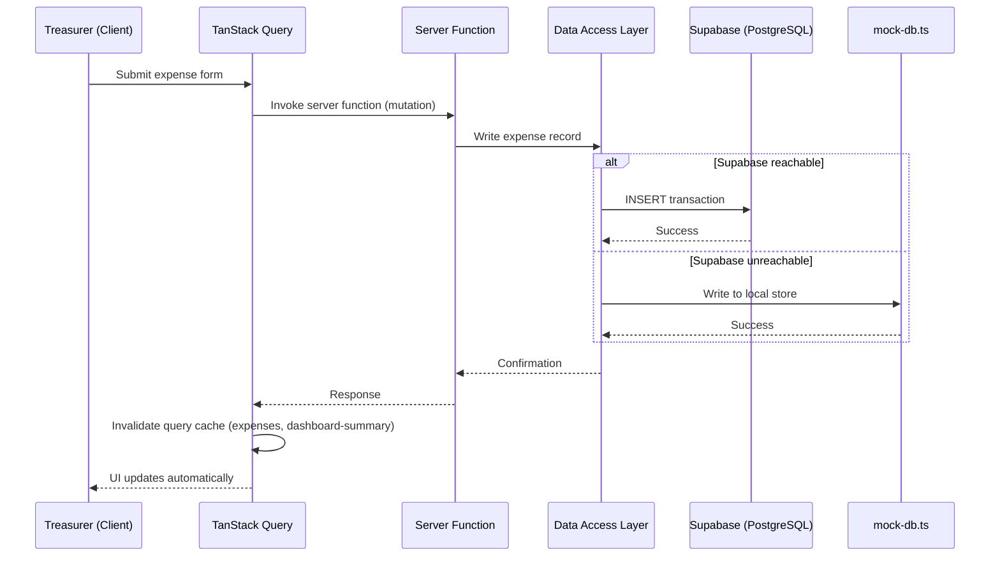
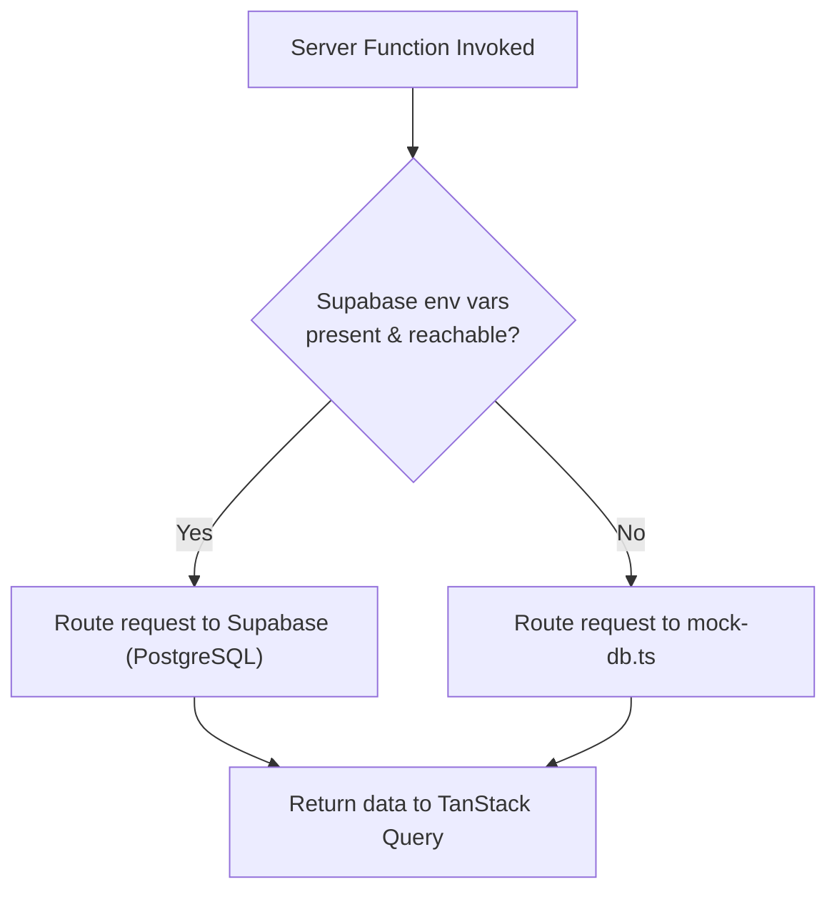

# Vaultly: Society Fund Transparency Dashboard
## Technical Project Report

**Project Type:** Web Application (Financial Transparency & Community Management Platform)
**Framework:** TanStack Start (Beta) with React 19
**Document Version:** 1.0
**Prepared For:** Internal Engineering & Stakeholder Review

---

## Abstract (Executive Summary)

Vaultly is a modern, full-stack web application designed to solve a persistent problem in residential community management: the lack of transparent, accessible, and real-time visibility into shared society funds. Residential societies and housing associations routinely collect maintenance fees and manage communal expenses, yet residents are frequently left in the dark regarding how these funds are utilized. Vaultly addresses this gap by providing a role-based dashboard that gives treasurers full administrative control over financial record-keeping while granting residents transparent, read-only visibility into the society's financial health.

Architecturally, Vaultly is built on TanStack Start, a React 19-based full-stack meta-framework that leverages server-side rendering (SSR) for performance and SEO-friendly delivery, paired with TanStack Router and TanStack Query for type-safe routing and efficient server-state management. The application's visual identity is defined by a premium dark-mode glassmorphism design system, combining deep near-black backgrounds, translucent frosted panels, neon accent gradients, and fluid Framer Motion animations to create an experience that feels more like a fintech product than a traditional community management tool.

On the data layer, Vaultly integrates Supabase (PostgreSQL) for authentication and persistent storage, but includes a distinguishing architectural feature: a local `mock-db.ts` fallback layer that ensures the application remains 100% functional even when the live database is unreachable or unconfigured — a critical resilience feature for demonstrations, offline development, and graceful degradation in production.

This report documents the complete technical architecture, design philosophy, implementation strategy, and deployment methodology behind Vaultly, including a detailed account of a real deployment challenge — a Vercel 404 routing error — and the specific Nitro server preset configuration that resolved it. The report is intended to serve as both a technical reference for future contributors and a case study in building resilient, production-grade SSR applications on modern React tooling.

---

## 1. Introduction

### 1.1 Problem Statement

Residential societies — apartment complexes, gated communities, and housing cooperatives — depend on pooled resident contributions (commonly called "maintenance fees") to fund shared services: security, housekeeping, utilities, repairs, and amenities. In most such communities, financial record-keeping is still handled through informal spreadsheets, printed notices, or verbal reporting during periodic meetings.

This creates three recurring issues:

- **Lack of Transparency:** Residents often have no direct way to verify how their contributions are spent, leading to distrust between residents and the managing committee.
- **Administrative Burden:** Treasurers and committee members manually track payments, dues, and expenses without dedicated tooling, increasing the likelihood of human error.
- **No Single Source of Truth:** Disputes arise because there is no shared, verifiable record that both administrators and residents can reference.

### 1.2 Project Objectives

Vaultly was conceived with the following core objectives:

1. Provide a **centralized digital ledger** for society income and expenses.
2. Enable **role-based access** so administrative powers are separated from resident visibility.
3. Deliver a **modern, trustworthy user experience** — financial tools should feel secure and polished, not like a bare-bones spreadsheet replacement.
4. Ensure **resilience and demonstrability** — the application should function even without a fully configured backend, which is particularly valuable during pilots, demos, and onboarding of new societies.
5. Build on a **scalable, type-safe, and maintainable technical foundation** suitable for iterative feature growth.

### 1.3 Scope

The current scope of Vaultly covers:

- Authentication and role-based session management.
- A treasurer-facing administrative dashboard with full CRUD capabilities over residents and transactions.
- A resident-facing read-only dashboard showing personal dues and society-wide financial summaries.
- Income and expense tracking with categorization and historical logging.
- A resilient data layer with automatic fallback to local mock data.
- Production deployment on Vercel using the Nitro server engine.

Out of scope for the current version: payment gateway integration (online fee collection), automated notification systems (SMS/email reminders), and multi-society (multi-tenant) support — all of which are addressed as future scope in Section 11.

---

## 2. Target Audience & Roles

Vaultly implements a two-tier role-based access control (RBAC) model. Rather than a granular permissions matrix, the application deliberately keeps roles simple and intuitive, reflecting the real-world structure of a residential society's governance.

### 2.1 Admin / Treasurer Role

The Admin (typically the elected Treasurer or a committee member) is granted full operational control:

- **Resident Management:** Create, update, and remove resident records, including unit numbers, contact details, and due amounts.
- **Financial Logging:** Record income entries (maintenance payments, event fees, miscellaneous collections) and expense entries (vendor payments, repairs, utilities).
- **Analytics Access:** View aggregated financial analytics — monthly income vs. expense trends, outstanding dues, and category-wise expense breakdowns.
- **Data Integrity Oversight:** Edit or correct previously logged transactions in case of clerical errors.

### 2.2 Member / Resident Role

The Member role is intentionally restrictive and read-only, reinforcing the transparency goal without exposing sensitive administrative controls:

- **Personal Payment Status:** View their own maintenance due status (paid, pending, overdue).
- **Society Financial Health:** View society-wide summaries — total funds collected, total expenses, and current balance — without access to underlying edit functions.
- **Historical Visibility:** Browse a read-only transaction history for full auditability.

**Figure 2.1 — Role-Based Access Model**



### 2.3 Design Rationale

This two-role model was chosen over a more complex permissions system because residential societies typically operate with a small, rotating set of trusted administrators (treasurers, secretaries) and a larger, relatively static base of residents whose primary need is visibility rather than control. This keeps the authentication and authorization logic simple, auditable, and easy to reason about — a deliberate architectural trade-off favoring simplicity over premature flexibility.

---

## 3. System Architecture

### 3.1 High-Level Architecture

Vaultly follows a **full-stack, server-rendered architecture** built entirely within a single TanStack Start application, rather than a decoupled frontend/backend split. This consolidates routing, data-fetching, and server logic into one coherent codebase while still supporting deployment as a modern serverless application.

At a high level, the architecture consists of four layers:

1. **Presentation Layer:** React 19 components styled with Tailwind CSS v4 and Radix UI primitives, animated using Framer Motion.
2. **Routing & Server Function Layer:** TanStack Router handles both client-side navigation and server-side route rendering; TanStack Start's server functions handle secure server-only logic (e.g., database mutations).
3. **Data-Fetching & Cache Layer:** TanStack Query manages server-state caching, background refetching, and optimistic updates for a responsive UI.
4. **Data Persistence Layer:** Supabase (PostgreSQL) serves as the primary data store, with the `mock-db.ts` module acting as an in-memory/local-storage fallback when Supabase is unavailable.

**Figure 3.1 — High-Level Architecture**



### 3.2 Server-Side Rendering (SSR) Model

TanStack Start renders routes on the server by default, meaning the initial HTML payload delivered to the browser is already populated with data-driven content (e.g., a resident's dashboard). This provides:

- **Faster perceived load times**, since the browser doesn't need to wait for client-side JavaScript to fetch and render data.
- **Improved SEO and shareability** for public-facing pages (e.g., a login page or public transparency summary).
- **Reduced client-side computation**, particularly beneficial for lower-powered devices used by residents.

After the initial SSR payload is delivered, the application "hydrates" into a fully interactive React 19 single-page application, at which point TanStack Router takes over client-side navigation and TanStack Query manages subsequent data fetching without full-page reloads.

### 3.3 Client-Server Interaction Flow

A typical interaction — for example, a treasurer logging a new expense — follows this flow:

1. The treasurer submits an expense form on the client.
2. A TanStack Start **server function** is invoked, executing exclusively on the server (never exposing database credentials to the client).
3. The server function attempts to write to Supabase. If Supabase is reachable and correctly configured, the transaction is persisted to PostgreSQL.
4. If Supabase is unreachable, misconfigured, or in a demo environment without credentials, the server function transparently falls back to the `mock-db.ts` layer, writing to an in-memory/local store instead.
5. TanStack Query invalidates and refetches the relevant query keys (e.g., `expenses`, `dashboard-summary`), triggering an automatic UI update without a manual refresh.
6. The updated financial data propagates to both the Admin dashboard and any Member-facing summary views.

This architecture ensures a **single, consistent data-access interface** regardless of which backend (Supabase or mock) is actively serving requests — a pattern elaborated further in Section 8.

**Figure 3.2 — Client-Server Interaction Flow (Logging an Expense)**



---

## 4. Technology Stack

| Layer | Technology | Purpose |
|---|---|---|
| **Framework** | TanStack Start (Beta), React 19 | Full-stack SSR meta-framework |
| **Routing** | TanStack Router | Type-safe, file-based routing with server/client parity |
| **State & Data Fetching** | TanStack Query (React Query) | Server-state caching, invalidation, and background sync |
| **Styling** | Tailwind CSS v4 | Utility-first styling with the new v4 engine |
| **UI Primitives** | Radix UI | Accessible, unstyled component primitives (dialogs, dropdowns, tabs) |
| **Animation** | Framer Motion | Micro-interactions, page transitions, glassmorphic hover/glow effects |
| **Backend / Auth** | Supabase (PostgreSQL) | Authentication, row-level data storage, session management |
| **Fallback Data Layer** | Custom `mock-db.ts` | Local, dependency-free data layer for resilience and demos |
| **Build Tool** | Vite | Development server and production bundling |
| **Server Engine** | Nitro (via TanStack Start) | Universal server runtime, adapter for deployment targets |
| **Deployment** | Vercel | Hosting, serverless function execution, edge delivery |

### 4.1 Why This Stack

- **TanStack Start** was chosen over alternatives like Next.js because of its first-class integration with TanStack Router and TanStack Query — tools already favored for their strong type safety — allowing the entire data-fetching and routing story to remain consistent end-to-end.
- **Tailwind CSS v4** was selected for its improved performance (Rust-based engine) and simplified configuration, well-suited to the highly custom glassmorphic design tokens Vaultly requires.
- **Radix UI** provides accessibility guarantees (keyboard navigation, focus management, ARIA compliance) out of the box, which is essential for a financial application used by residents of varying technical literacy and age groups.
- **Supabase** offers a managed PostgreSQL instance with built-in authentication, reducing backend infrastructure overhead while still providing full SQL query flexibility for financial reporting.

---

## 5. UI/UX & Design System

**Figure 5.0 — Vaultly Member Dashboard (Live Screenshot)**


*The resident-facing dashboard for Green Valley Residency, showing the glassmorphic sidebar navigation, a personalized greeting card with "My Flat" and "Pending Dues" summary tiles, a premium hero illustration, and quick access to the Notice Board and My Payments panels below the fold.*

### 5.1 Design Philosophy

Vaultly's visual identity was intentionally designed to depart from the utilitarian, spreadsheet-like aesthetic typical of society management tools. Since the application handles financial trust — arguably its most important currency — the design leans into a **premium, dark-mode glassmorphism** aesthetic reminiscent of modern fintech and crypto dashboards, signaling security, sophistication, and modernity.

### 5.2 Core Visual Elements

- **Deep Dark Backgrounds (`#0a0a0a`):** A near-black base canvas reduces eye strain and makes accent colors and data visualizations pop with higher contrast.
- **Translucent Glass Panels:** Cards and containers use semi-transparent backgrounds with `backdrop-blur` effects, creating a layered, "frosted glass" depth that separates content zones without heavy borders.
- **Vibrant Neon Accents:** Strategic use of glowing accent colors (electric blues, purples, greens) for key metrics, call-to-action buttons, and status indicators (e.g., green glow for "paid," amber for "pending," red for "overdue").
- **Glowing Borders:** Subtle box-shadow-based borders that illuminate on hover or focus, reinforcing interactivity without relying on jarring color shifts.
- **Fluid Micro-Animations:** Framer Motion powers entrance animations for dashboard cards, smooth number transitions for financial figures (e.g., animated counters), and hover-state scaling/glow effects on interactive elements.

### 5.3 Empty States & Illustrations

Rather than displaying blank tables or generic "No data" text, Vaultly uses **custom premium illustrations** for empty states (e.g., a society with no residents yet, or a month with no logged transactions) and for hero banners on key landing screens. This reinforces the premium feel even in edge cases and reduces the perceived "unfinished" quality common in early-stage internal tools.

### 5.4 Accessibility Considerations

Despite the stylized dark aesthetic, care was taken to maintain WCAG-conscious contrast ratios for text over translucent panels, and Radix UI's accessibility primitives ensure that glassmorphic components (modals, dropdowns, tooltips) remain fully keyboard-navigable and screen-reader compatible.

---

## 6. Core Modules & Implementation Details

### 6.1 Dashboard Module

The dashboard is role-aware: the same route renders different data views depending on the authenticated user's role.

- **Admin Dashboard:** Displays total funds collected, total expenses, net balance, a monthly income/expense trend chart, and a list of residents with outstanding dues.
- **Member Dashboard:** Displays the resident's personal due status, a simplified society-wide balance summary, and recent transaction history (read-only).

Data for both views is fetched via TanStack Query hooks that call shared server functions, with role-based filtering applied server-side before data ever reaches the client — ensuring residents cannot access administrative data even by inspecting network requests.

### 6.2 Residents CRUD Module

The Residents module is the administrative backbone of Vaultly, allowing the Treasurer to:

- **Create:** Add new residents with unit number, name, contact info, and default maintenance due.
- **Read:** View a searchable, filterable list of all residents and their current due status.
- **Update:** Edit resident details or manually adjust due amounts (e.g., for prorated charges).
- **Delete:** Remove residents who have vacated the property.

All mutations pass through server functions that validate input, apply the change to Supabase (or the mock fallback), and trigger TanStack Query cache invalidation so the resident list updates instantly across the UI.

### 6.3 Income & Expense Tracking Module

This module maintains the financial ledger at the heart of Vaultly's transparency mission:

- **Income Entries:** Logged with a source (e.g., "Monthly Maintenance – Unit 4B"), amount, date, and category.
- **Expense Entries:** Logged with a vendor/description, amount, date, and category (e.g., Security, Housekeeping, Repairs, Utilities).
- **Categorization:** Both income and expenses support category tagging, enabling category-wise breakdown visualizations on the Admin analytics view.
- **Immutable Audit Trail:** While entries can be corrected by an Admin, each record retains a timestamp, supporting basic auditability.

### 6.4 Authentication Module

Authentication is handled via Supabase Auth, integrated into TanStack Start's SSR request lifecycle:

- On each server-rendered request, the user's session token is validated server-side before any protected route data is fetched.
- Role information (Admin vs. Member) is stored as a claim/attribute on the user's profile record and checked on every server function invocation, not just at the UI routing level — preventing privilege escalation via direct API calls.
- Protected routes redirect unauthenticated users to a login screen; role-mismatched access attempts (e.g., a Member navigating directly to an Admin-only route) are redirected to their appropriate dashboard rather than shown an error, preserving a smooth user experience.

---

## 7. Database Strategy

### 7.1 Primary Layer: Supabase (PostgreSQL)

Supabase serves as Vaultly's production data store, chosen for its combination of a fully managed PostgreSQL database, built-in authentication, and auto-generated APIs. Core tables include residents, transactions (income/expense), and user-role mappings, with relational integrity enforced via foreign keys (e.g., linking a transaction to the resident who made a payment).

### 7.2 Resilience Layer: `mock-db.ts`

A defining architectural feature of Vaultly is its **local fallback data layer**, implemented in `mock-db.ts`. This module mirrors the shape and interface of the Supabase data-access functions, meaning the rest of the application never needs to know which backend is actually serving a given request.

**Design pattern:**

- A thin **data-access abstraction layer** sits between server functions and the actual data source.
- On application startup (or per-request), this layer checks whether valid Supabase credentials and connectivity are available.
- If Supabase is reachable, all reads/writes are routed to PostgreSQL as normal.
- If Supabase is unreachable — due to missing environment variables, network issues, or a deliberately unconfigured demo environment — the layer transparently redirects all reads/writes to `mock-db.ts`, which simulates persistence using in-memory objects/local storage seeded with realistic sample data (sample residents, sample transactions).

**Figure 7.1 — Data Source Resolution Logic**



**Why this matters:**

- **Demo Reliability:** Sales demos, stakeholder walkthroughs, and portfolio showcases can run Vaultly with zero backend configuration, and the UI remains fully functional and populated with realistic data.
- **Developer Experience:** New contributors can clone the repository and run the app locally without needing Supabase credentials to start developing on the UI layer.
- **Graceful Degradation:** In the rare event of a production Supabase outage, the application avoids a hard crash or blank-screen failure, instead degrading to a read-only-feeling mock state rather than becoming entirely unusable.

This pattern reflects a broader software engineering principle: **designing for the absence of dependencies**, not just their presence — a resilience consideration often overlooked in early-stage applications.

---

## 8. Deployment & DevOps

### 8.1 Deployment Target: Vercel

Vaultly is deployed on Vercel, chosen for its tight integration with modern JavaScript frameworks, automatic preview deployments on pull requests, and serverless function support that aligns naturally with TanStack Start's SSR execution model.

### 8.2 The Nitro Server Engine

TanStack Start uses **Nitro** — the same universal server engine that powers Nuxt — as its underlying server runtime. Nitro is responsible for translating the application's server functions and SSR routes into a deployable server bundle, and critically, it supports **preset-based adapters** for different hosting targets (Node.js, Vercel, Netlify, Cloudflare Workers, etc.).

For Vaultly, the `vite.config.ts` file explicitly configures:

```ts
nitro({ preset: 'vercel' })
```

This tells Nitro to output the build in **Vercel's Build Output API format** — a specific directory and manifest structure that Vercel's platform expects in order to correctly wire up serverless functions, static assets, and routing rules. Without this explicit preset, Nitro defaults to a generic Node.js server build, which Vercel cannot correctly interpret as a serverless deployment, leading to the deployment issue detailed in Section 9.

### 8.3 CI/CD Flow

- Every push to the main branch triggers an automatic Vercel production deployment.
- Pull requests generate isolated preview deployments, allowing UI/UX review of the glassmorphism design changes before merging.
- Environment variables (Supabase URL and anon key) are configured directly in the Vercel dashboard, kept out of source control, and their absence is precisely what triggers the `mock-db.ts` fallback in preview/demo environments.

---

## 9. Challenges & Solutions

### 9.1 Challenge: Vercel 404 Deployment Error

**Symptom:** After an initial deployment of Vaultly to Vercel, all routes returned a 404 "Page Not Found" error, despite the application building and running correctly in local development (`vite dev`) and even in a local production preview.

**Root Cause Analysis:** TanStack Start is an SSR framework, meaning it requires a running server process capable of handling dynamic route rendering and server functions on every request — it is fundamentally different from a static single-page application (SPA) that simply serves a pre-built `index.html` and lets client-side JavaScript handle routing. By default, without an explicit deployment target configured, Nitro's build output was structured generically and was not recognized by Vercel's platform as a valid serverless/SSR deployment. Vercel's routing layer, unable to locate matching serverless functions or a compatible output manifest for the requested routes, fell back to returning 404 errors for all paths.

**Solution:** The fix required explicitly registering the Nitro Vite plugin with the `vercel` preset inside `vite.config.ts`:

```ts
import { defineConfig } from 'vite';
import { nitro } from 'nitro/vite'; // conceptual import reference
import tanstackStart from '@tanstack/start/plugin/vite';

export default defineConfig({
  plugins: [
    tanstackStart(),
    nitro({ preset: 'vercel' }),
  ],
});
```

This explicit preset instructs Nitro to emit output specifically shaped for **Vercel's Build Output API** — including the correct `.vercel/output/functions` structure for server-rendered routes and `.vercel/output/static` for static assets. Once this configuration was applied and redeployed, Vercel correctly recognized each route's corresponding serverless function, and the 404 errors were fully resolved.

**Lesson Learned:** When deploying meta-frameworks built on universal server engines like Nitro, it is essential to verify that the deployment preset matches the actual hosting target — the "it works on my machine" (or even "it works in local preview") signal is insufficient, because local previews often run a generic Node server rather than the platform-specific adapter used in production. This challenge is now documented internally to prevent recurrence for future contributors deploying similar TanStack Start applications.

### 9.2 Challenge: Backend Availability During Demos

**Symptom:** Early demo attempts of Vaultly, run in environments without Supabase credentials configured, resulted in unhandled errors and blank dashboard screens.

**Solution:** This directly motivated the design and implementation of the `mock-db.ts` fallback layer described in Section 8, ensuring the application detects unavailable or unconfigured Supabase connections and gracefully substitutes realistic mock data, preserving full UI functionality regardless of backend state.

### 9.3 Challenge: Balancing Visual Richness with Accessibility

**Symptom:** Early glassmorphism prototypes, while visually striking, produced text-contrast issues on translucent panels, particularly for financial figures that needed to remain highly legible.

**Solution:** Design tokens were refined to enforce a minimum opacity floor for panel backgrounds and to pair neon accent text exclusively with solid (non-translucent) backing surfaces for critical numeric data, preserving both the aesthetic and legibility.

---

## 10. Conclusion & Future Scope

### 10.1 Conclusion

Vaultly demonstrates that financial transparency tools for residential communities need not be visually or architecturally utilitarian. By combining a modern SSR-based full-stack framework (TanStack Start), a rigorous role-based access model, and a premium glassmorphic design language, Vaultly delivers both administrative power for treasurers and genuine transparency for residents — the two outcomes most commonly missing from traditional society management practices.

Architecturally, the project's most notable contribution is its resilience-first data strategy: the `mock-db.ts` fallback layer ensures Vaultly remains functional and demonstrable under any backend condition, a pattern with broader applicability beyond this specific project. Equally, the resolution of the Vercel/Nitro deployment challenge underscores the importance of explicit, platform-aware server configuration when working with modern meta-frameworks — a lesson directly transferable to other TanStack Start or Nitro-based deployments.

### 10.2 Future Scope

Planned enhancements for future iterations of Vaultly include:

- **Online Payment Integration:** Direct maintenance fee collection via payment gateways (e.g., Razorpay, Stripe), with automatic reconciliation against the income ledger.
- **Automated Notifications:** Email/SMS reminders for upcoming or overdue dues, and monthly financial summary digests for residents.
- **Multi-Society (Multi-Tenant) Support:** Extending the data model and authentication scheme to support multiple independent societies within a single Vaultly deployment.
- **Document & Receipt Attachments:** Allowing treasurers to attach scanned invoices/receipts to individual expense entries for stronger audit compliance.
- **Advanced Analytics:** Year-over-year financial comparisons, budget vs. actual tracking, and predictive maintenance fund forecasting.
- **Mobile-Native Experience:** A dedicated mobile application (or PWA enhancement) to improve accessibility for residents less inclined to use desktop browsers.

Taken together, Vaultly represents a strong foundational architecture — technically sound, visually distinctive, and philosophically aligned with its core mission of financial transparency — with a clear and extensible roadmap for continued growth.

---

*End of Report*
